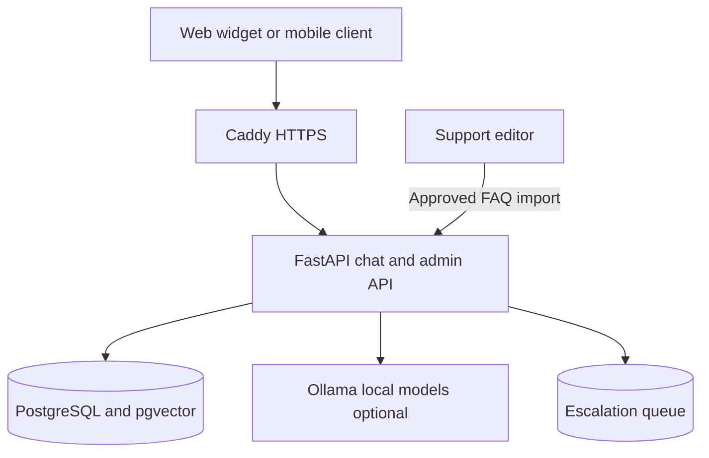
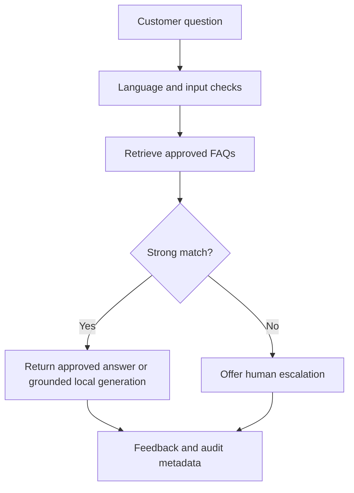

# XYZ E-Commerce Level 1 Chatbot

An implementation of the attached project plan. The supplied document defines goals and roles, but contains no actual customer logs, policies, commerce API, branding, or production domain. The 21 included FAQ translations are **clearly marked examples** with `approved=false`. They must be replaced and reviewed before launch. No paid API is required; hosting, hardware, domain registration, backups, and staff time may still cost money.

## 1. Architecture

**Trust boundary:** the browser is untrusted. Admin routes need a secret API key. Approved FAQ imports are a staff operation. Website origin restrictions and rate limits reduce casual abuse but are not authentication. The DB and Ollama have no published ports in production. The API stores only a pseudonymous session ID and messages; contact details are submitted separately with explicit consent.

**Retrieval:** lexical overlap is always available. If `ENABLE_AI=true`, the importer and queries also use Ollama's `nomic-embed-text` embeddings stored in pgvector; this reference implementation scores cosine similarity in the API over the approved FAQs for the selected language. It suits a modest curated FAQ collection; for a large knowledge base, move candidate selection into a pgvector indexed query. A high-confidence approved FAQ is answered; otherwise the system escalates. With `ENABLE_GENERATION=true`, the local generator may phrase an answer using only the retrieved FAQ, but its output still needs real multilingual UAT. For the safest initial rollout leave generation disabled: retrieval augmented, approved answers are returned verbatim.

## 2. Local setup

1. Install Docker Engine and the Docker Compose plugin. Copy `.env.example` to `.env` and replace **all** placeholder secrets. Keep `SITE_ADDRESS=:80` for local access. Keep `.env` out of version control.
2. Run `docker compose up -d --build db api web`. Open `http://localhost:8080`. The API health route is `http://localhost:8080/api/health`.
3. To inspect the import format, run `docker compose exec -T api python -m app.import_faq < data/faq.example.csv` from the host shell. All sample rows have `approved=false`, so the chatbot correctly escalates instead of serving invented policy. For functional testing, create a staging-only copy, review its answers, then set selected rows to `true` and reimport. For launch, replace samples with real XYZ policy content and obtain support-team approval.
4. To enable local AI, run `docker compose --profile ai up -d ollama`, `docker compose exec ollama ollama pull nomic-embed-text`, and optionally `docker compose exec ollama ollama pull qwen2.5:3b`. Set `ENABLE_AI=true` and (optionally) `ENABLE_GENERATION=true` in `.env`, restart API, and import FAQs again to compute embeddings. Model downloads need internet and several GB of disk/RAM. When Ollama fails, the API falls back to lexical retrieval and approved answers.
5. `ADMIN_API_KEY` is for staff scripts only; never put it in web or mobile JavaScript. Use `curl -H "X-Admin-Key: ..."` on `/api/admin/tickets` and `/api/admin/feedback` from a trusted terminal. For import, use the API container command shown above with restricted host access.

## 3. API and integration

`POST /api/chat` accepts `{ "session_id": "optional UUID", "message": "...", "language": "en|my|th" }`. The response includes `answer`, `source_id`, `confidence`, `escalate`, and `session_id`. `POST /api/escalations` accepts `{ "session_id": "UUID", "contact": "email or phone", "consent": true }`. `POST /api/feedback` accepts `{ "session_id": "UUID", "rating": 1|-1 }`. The mobile app uses the same JSON API over HTTPS. The included `web/widget.js` is a small embeddable widget; include it on your storefront and set `data-api-base="https://chat.example.com"` when hosted on another origin. Add that storefront origin to `ALLOWED_ORIGINS`.

Order status, payment actions, refunds, authentication, and agent notifications require real XYZ systems and policies. No demo endpoint claims to perform those actions. Tickets are stored for staff review; connect `/api/admin/tickets` to an authenticated support console or ticket system before go-live.

## 4. Production rollout

1. Obtain a server and domain. Set DNS A/AAAA to the host and open TCP 80/443. Set `SITE_ADDRESS=chat.example.com`, `HTTP_PORT=80`, and `ALLOWED_ORIGINS=https://shop.example.com,https://chat.example.com`. Run `docker compose up -d --build`. Caddy obtains HTTPS certificates. Keep `POSTGRES_PASSWORD` and `ADMIN_API_KEY` long, unique, and private.
2. Run approved imports only after redacting names, addresses, payment details, credentials, and order IDs from historical logs. Write curated questions and approved responses into `data/faq.csv`, then import. Do not upload raw support logs to the model.
3. Use a separate staging deployment and real support staff to approve FAQ accuracy in English, Burmese, and Thai. Test mobile client and storefront origins, accessibility, escalation staffing, load, and incident response. The attached plan calls for **90% correct Level 1 FAQ answers**, **90% answered within 10 seconds**, and a **30% reduction in routine manual queries after three months**. These are acceptance targets, not measured results of this repo.
4. Back up Postgres daily to encrypted off-host storage; test restore monthly. Example: `docker compose exec -T db pg_dump -U "$POSTGRES_USER" "$POSTGRES_DB" > backup.sql` (load `.env` variables in your shell first). Protect the dump as customer data. Deploy updated images with `docker compose ... up -d --build`; retain the previous image and a tested DB backup for rollback. Schema changes need a migration plan before modifying models.
5. Monitor health, HTTP latency/error rates, unanswered and escalated queries, language quality, ticket age, free disk, DB backup success, and local model CPU/RAM. Set retention appropriate to local law and policy (`RETENTION_DAYS`, default 30); schedule `python -m app.purge` daily inside the API container. Restrict host SSH, patch OS/images, enable firewall and encrypted backups.

**Launch gate:** this is a runnable reference implementation, not a finished XYZ production service. Go-live needs XYZ policy content and integrations, an authenticated staff workflow, load testing on chosen hardware, security review, privacy assessment, and written UAT approval. The sample FAQ intentionally cannot satisfy those gates.

## 5. Tests

Run `docker compose run --rm api pytest -q`. Unit tests cover retrieval thresholds and prompt safety; API integration tests use a disposable database URL supplied as `TEST_DATABASE_URL` (see `api/tests`). `docker compose config` validates configuration. This environment did not have Docker installed when the project was authored; see the verification note at delivery.

## 6. File map

`api/app` API, models, retrieval, Ollama, imports and retention; `api/tests` tests; `web` client/widget; `data` clearly labeled sample FAQs; `deploy/Caddyfile` proxy; `.github/workflows` CI; `compose.yaml` development and production orchestration.
